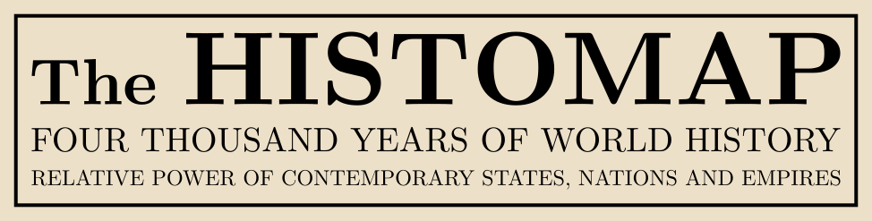
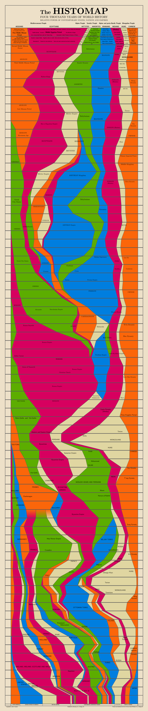

<h1 align="center"></h1>

This repository have the goal to vectorise the original *Histomap* poster who was published by “Histomap Inc” and also traduce it into french.

The histomap is a chronological map of empires, civilisations, and cultures. It’s not longer consider as correct now a days but it’s an interesting artistical work.

## Current state

## Minimal requirement
* [Inkscape](https://inkscape.org/)
* [sed](https://www.gnu.org/software/sed/)
* [Computer Modern font](https://cm-unicode.sourceforge.io/download.html)
